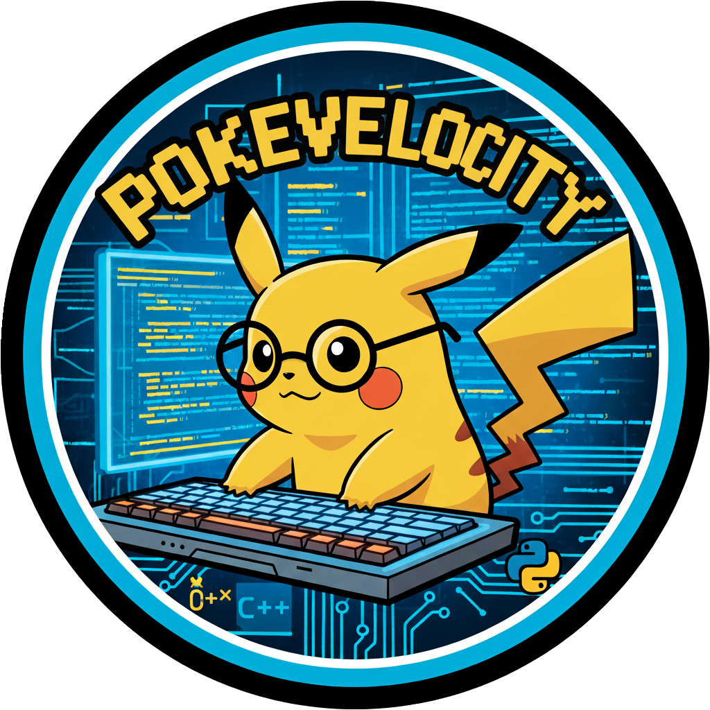
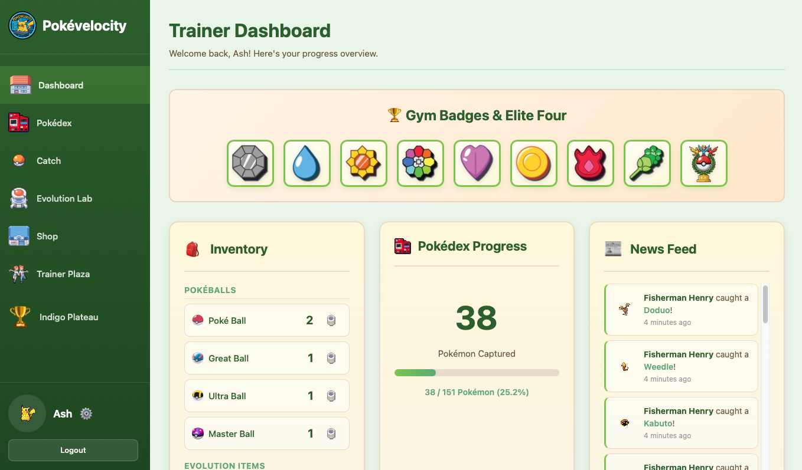
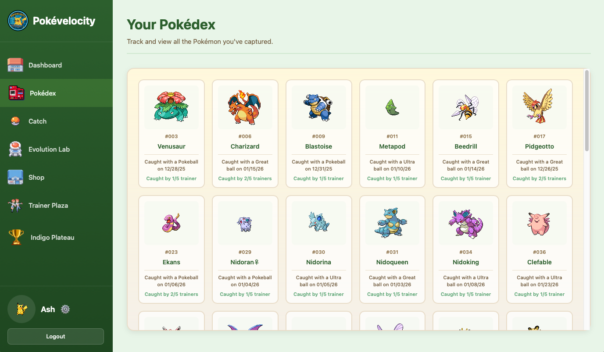
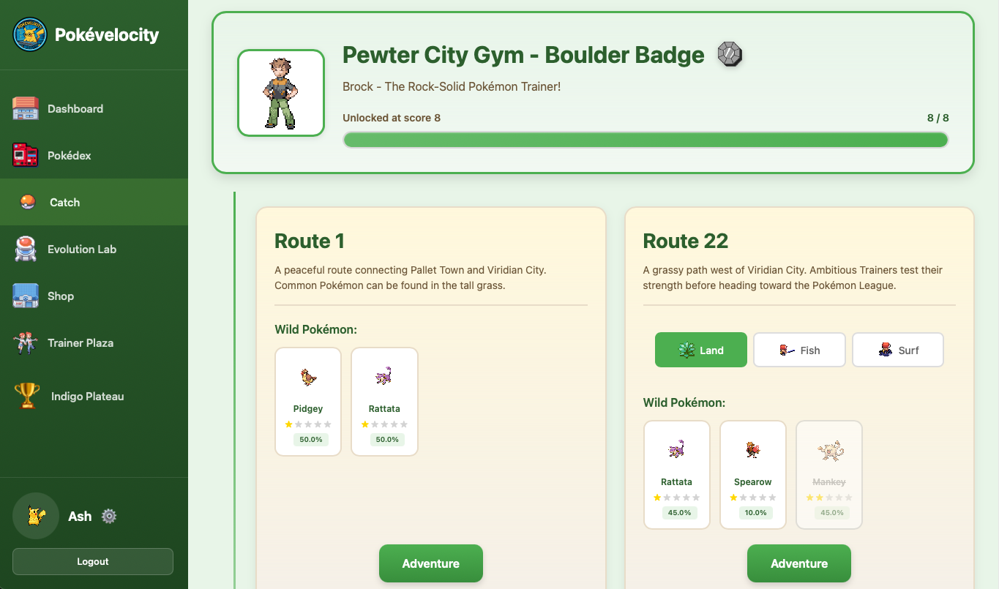

# Pokevelocity!


Current version: v1.4.0

Pokévelocity is a gamified productivity app that turns software development into a Pokémon-catching adventure. Complete your dev tickets,
earn Pokéballs based on story points, and use them to catch all 151 original Pokémon as you adventure through Kanto (Pokemon Red and Blue/Fire Red and Leaf Green). The harder your tickets and the faster your velocity, the more and better Pokéballs you'll earn
giving you higher catch rates. Track progress in your Pokédex, gather gym badges, compete on the leaderboard with teammates, and prove you can truly code 'em all. Built for development teams who want to add a fun, nostalgic twist to sprint
velocity tracking.

Upon spin up, the user activation code will be PALLET but you're encouraged to change that to a different 6 character string immediately
This can be done in the `validation_codes` table.

**Note:** This is an unofficial fan project and isn’t associated with Nintendo, The Pokémon Company, or any other company in any way.
It’s simply my way of celebrating the nostalgia I have for the original Pokemon games and sharing something fun with the developer community.
This project is strictly and entirely non-commercial — I haven’t, can’t, and won’t accept any form of payment from the creation of this project.





## Running the App

### Option 1: Docker Compose (Recommended)

The easiest way to get started is with Docker Compose (make sure Docker is running):

```bash
docker compose up
```

**First time startup:**
- Starts a PostgreSQL database with persistent storage
- Builds and starts the Rails application
- Creates the database and runs migrations
- Seeds the database with all 151 Pokémon, routes, and the PALLET activation code
- Makes the app available at http://localhost:3000

**To stop the app:**
```bash
# Press Ctrl+C in the terminal, or run:
docker compose down
```

To completely remove all data and start fresh:
```bash
docker compose down -v
```

## Upgrading to a New Version

```bash
git pull
docker compose down
docker compose up --build
```

Your data and progress are preserved automatically.

### Option 2: Local Development

If you prefer to run the app locally without Docker:

1. Install PostgreSQL
2. Install Ruby 3.3.6
3. Install dependencies: `bundle install`
4. Set up the database: `rails db:setup`
5. Run the server: `rails server`